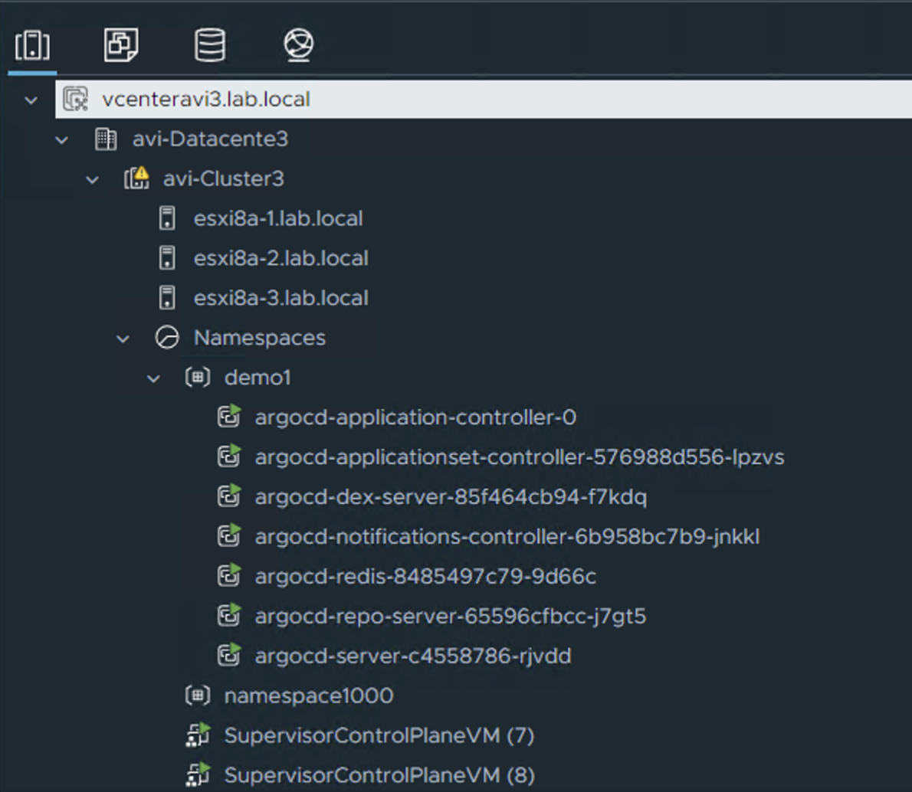

# GitOps on vSphere with Tanzu leveraging ArgoCD

*NOTE* - This has been tested on vCenter 8.0u2. Supervisor version 1.26.


* In this example, we will be using the vSphere Namespace (pre-created from vCenter) called `demo1`. Users can change the reference as needed. 
* We will be deploying ArgoCD in the `demo1` vSphere Namespace.
* A tagged datastore called `tanzu` is needed
* Using ArgoCD, we will deploy a Classy Cluster `workload-vsphere-tkg1`.
* Once the cluster deployment complete, the `PostSync` job hook within ArgoCD will add the new cluster to ArgoCD.
* The job will then install `cert-manager` and `contour` K8s addons to the workload cluster deployed in the previous step. 

## ArgoCD installation (to be executed on the Supervisor Control Plane VM)
(Connect to Supervisor VM: https://github.com/ogelbric/argocd/blob/main/extra/info.md)
```
bash
# Install wget
tdnf install wget
wget https://raw.githubusercontent.com/argoproj/argo-cd/stable/manifests/install.yaml
vi install.yaml # There are two ClusterRoleBindings with reference to "namespace: argocd". Change them to "namespace: demo1" and save the file. File is very big search for exact string! 
kubectl apply -f install.yaml -n demo1
# The above command may not work as its pulling image from dockerhub and end up with rate limiting issues. If so perform the next two commands - 
# kubectl create secret docker-registry regcred  --docker-username="{{DOCKERHUB USERNAME}}" --docker-password='{{DOCKERHUB PASSWORD}}' --docker-email={{DOCKERHUB EMAIL}} -n demo1
# kubectl patch serviceaccount default -p '{"imagePullSecrets": [{"name": "regcred"}]}'
# kubectl patch deployment argocd-redis -n demo1 -p '{"spec": {"template": {"spec": {"imagePullSecrets": [{"name": "regcred"}]}}}}'

# Monitor deployment
# k get pods -n demo1
# k get events -n demo1

# Expose the argocd-server service as type LoadBalancer and get the IP address of the UI service. 
# This can be later modified to expose the service as type Ingress or HttpProxy
kubectl patch svc argocd-server -n demo1 -p '{"spec": {"type": "LoadBalancer"}}'
kubectl get svc argocd-server -n demo1 -o json|jq -r '.status.loadBalancer.ingress[0].ip'

# We need to modify the RBAC on the ARGOCD NS to add new clusters and applications dynamically. 
wget https://raw.githubusercontent.com/ogelbric/argocd-gitops-tanzu/main/Dockerfile-synchook/rbac.yaml
kubectl apply -f rbac.yaml -n demo1
```
Result in vCenter (Native PODs): 



## Login to ArgoCD for the first time
```bash
# Download the relevent ArgoCD CLI

# Login to the Supervisor API
kubectl vsphere login --insecure-skip-tls-verify --server {{SUPERVISOR IPADDRESS}} -u administrator@vsphere.local
# Update the kubeconfig context to the {{SUPERVISOR IPADDRESS}}
argocd admin initial-password -n demo1
argocd login {{IPADDRESS OF ARGOCD SERVER}}
argocd account update-password
```

You can now login to the ArgoCD UI with the new admin password.

## Deploy a classy cluster using the sample manifest provided in the tkc folder in this repo

Using the UI or the CLI create the initial cluster creation jon. The `tkgs-cluster-class-noaz.yaml` is the sample file. You can close this repo, modify the yamls and execute setup as per your requirements. 
```bash
argocd app create tkc-deploy --repo https://github.com/papivot/argocd-gitops-tanzu.git --path tkc --dest-server https://kubernetes.default.svc --dest-namespace demo1 --auto-prune --sync-policy auto
# for e.g.
# argocd app create {{NAME OF JOB}} --repo {{PATH OF GIT REPO}} --path {{DIRECTORY OF THE CLUSTER YAML}} --dest-server https://kubernetes.default.svc --dest-namespace {{SUP NAMESPACE WHERE CLUSTER IS TO BE DEPLOYED}} --auto-prune --sync-policy auto
```

This single command should do the magic !!!
